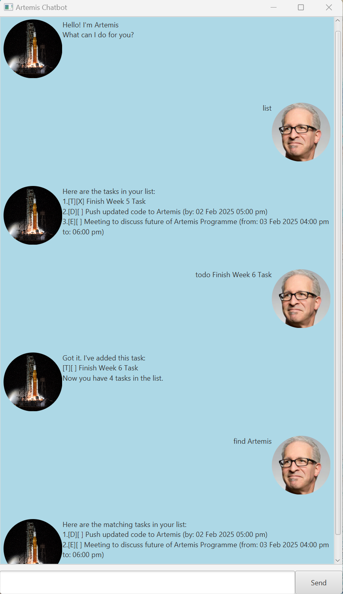

# ArtemisPro User Guide

## Introduction
ArtemisPro is a task management bot that helps you remember tasks so we can get back to the moon again.
It's, text-based, lightweight and very easy to learn and use.

It allows you to manage tasks by listing, adding, marking, unmarking, deleting, finding and sorting tasks!
It has "memory" so your data will persists even after closing the app!

## Sample GUI Screenshots


## Adding deadlines

// Describe the action and its outcome.

// Give examples of usage

Example: `keyword (optional arguments)`

// A description of the expected outcome goes here

```
expected output
```

## Feature ABC

// Feature details


## Feature XYZ

// Feature details